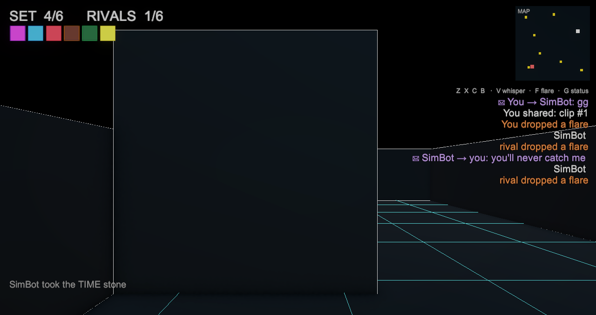

<h1 align="center">◈ ORBSTONIA ◈</h1>

<b>SIX STONES &nbsp;·&nbsp; ONE THRONE</b>

  

  
  &nbsp;
  
  &nbsp;
  

---

## Race for the stones. Rule the arena.

Six Orb Stones are scattered across a glowing vector grid. Hunt them down, snatch
them, and complete the set before your rivals do — **the first to hold all six
takes the throne.** Cut their routes, outrun their claims, own the board.

Pure neon. Pure speed. Pure skill.

## ⬇️ Play now

| | Platform | |
| :--: | --- | --- |
| ▶️ | **Play in your browser** — no download | **[orbstonia.com](https://orbstonia.com)** |
| 🍎 | **macOS** | **[Download](https://github.com/jyswee/orbstonia/releases/latest/download/ORBSTONIA-macOS.zip)** |
| 🤖 | **Android** | **[Download APK](https://github.com/jyswee/orbstonia/releases/latest/download/ORBSTONIA-Android.apk)** |
| 🪟 🐧 | Windows · Linux | *coming soon* |
| 📱 | iOS · Google Play | *coming soon* |

## Why you'll stay

- ⚡ **Real-time multiplayer** — every rival's move, live. Chase, block, and snipe the last stone out from under them.
- 🕹️ **80s vector, modern feel** — Tron-grade neon wireframes, bloom, and particle trails on pure black.
- 🌍 **Play anywhere** — browser, desktop, or mobile twin-stick controls.
- 🎯 **Fair to the core** — cosmetics only. Skill wins, never your wallet.

  

---

⚡ Real-time multiplayer powered by <a href="https://oddsockets.com"><b>OddSockets</b></a>

<b>Copyright © 2026 Tyga.Cloud Ltd. All rights reserved.</b>

ORBSTONIA™ and the ORBSTONIA logo are trade marks of Tyga.Cloud Ltd. 
Protected automatically in the 182 contracting parties of the <a href="https://www.wipo.int/treaties/en/ip/berne/">Berne Convention</a> (WIPO) — no registration required. 
See <a href="COPYRIGHT">COPYRIGHT</a> for the full notice. No licence is granted by publication. 
The OddSockets client SDKs are published separately under the MIT Licence.

